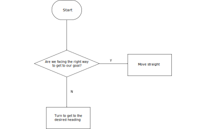
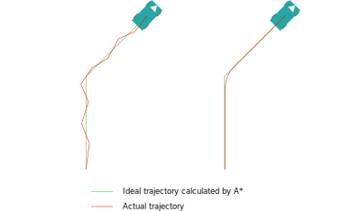

# Controls #

The purpose of our controls stack is to determine the motor outputs to get the robot from its current state to the
desired state as chosen by planning. Our robot effectively has 4 drive surfaces: the left drive motor, the right drive
motor, the intake motors (which we move in the same direction), and the output motor. Most of the logic is for
calculating the speeds for the drive motors.

Although the planning stack returns an entire trajectory from start to some goal an arbitrary distance away, controls is
only focused on the current state and the very first waypoint of the trajectory. Note that this means our "goal" does
not have the same meaning as the "goal" calculated by planning.

Our current drive logic is very simple, as summed up in the flowchart below: if we're not facing the goal, turn until
we're facing the goal. If we *are* facing the goal, simply drive straight towards it. In our initial version, we would
move at a constant rate and would often overshoot our desired heading when turning or overshoot our goal when driving
straight and zig-zag over it without ever completely achieving the goal state. For this reason, we added PID loops to
ensure we more accurately achieve the desired state more accurately and with minimal overshooting.

The controls stack also supports driving in reverse because we need to outtake balls into the goal from the rear of the
robot. For this case, we simply flip our desired heading by 180 degrees while turning in-place and flip the signal to
the motors when driving straight.

Lastly, controls also supports running just the intakes or just the outtake. There are currently only two supported
modes: running just the intakes or running hte outtake. In either case we simply run the intakes/outtake at full speed.

## Future Work ##
Our current stack only supports turning in-place or moving straight ahead. Although this was very simple to code up,
this driving behavior is very slow compared to driving while turning slightly because the robot often deviates slightly
from the trajectory calculated by A*. This often results in the robot zig-zagging over a straight trajectory rather than
driving straight to the next waypoint as shown in the figure below. Although adding this capability would help speed up
the robot, it's possible that the robot might collide with an obstacle while clipping a turn, so there may need to be
some closer integration with planning to prevent this.

