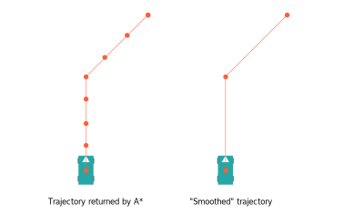

# Geometry #

Our code currently ships with a geometry library. While we developed it alongside Automated Infinite Recharge, we'd
eventually like to separate it into its own project so that it can be reused by our team in the future and by other
teams.

## Occupancy Grid ##

The largest component of our geometry library is the occupancy grid. Ours is simply an MxN array of cells that can get
and set occupancy, which is currently binary. Because this grid is designed for A*, each cell also contains a list of
its 8 neighbors and can be assigned a "parent," or a preceding cell from which the cell was discovered.

Although the grid supports setting individual cells to occupied/unoccupied, we instead use the following two methods for
inserting rectangular and polygonal obstacles into the grid.

### Insert Rectangular Obstacle ###

This method simply identifies the cells partially or fully covered by the given rectangle and marks them as occupied.

### Insert Convex Polygonal Obstacle ###

This method is based off an algorithm we found written by [Darel Rex Finley](https://alienryderflex.com/polygon_fill/)
in 2007. The original algorithm was intended to determine which pixels on a screen correspond to a given polygon. We
decided to reimplement the algorithm in Python, but implement a simpler version which works on only convex polygons,
since that's all we really needed.

Our algorithm iterates column-by-column, identifying where the current column crosses the edges of the polygon and
marking all cells in between as occupied. For example, in the below image we are inserting the green polygon into the
grid. We first find the "contact points" of the polygon within the current column -- the points where our column
intersects with the edges of the polygon, shown below as orange dots. Next, we simply mark the cells between these
contact cells as occupied, inclusive. Because we limit ourselves to convex polygons, we are guaranteed at most two
contact points. As an additional optimization, we identify the region of the grid and only iterate over the relevant
columns and rows rather than the entire grid.

## Polygon ##
The polygon class holds a collection of vertices as well as associated information: the center, bounding box, and
whether the shape is convex.

### Counterclockwise ###

This method simply tells us whether three points form a clockwise or counterclockwise turn. It has many applications in
the polygon class, e.g. for determining convexity.

### Point in Convex Polygon ###

This method simply tells us whether a point P is inside or outside of a polygon. There are several accepted solutions to
this problem, but we chose to implement a simple version which only works for convex polygons using
`counterclockwise()`.

Our method simply walks around the edges of the polygon in order and makes sure the point P is to the left of every edge
-- if it is, then the polygon is convex. Currently, this method throws an error if used on a non-convex polygon. In the
future we intend to create a separate convex polygon class with this method, while the superclass has its own
slower, general-purpose point-in-polygon check.

## Algorithms ##

### A* ###

A* is the search algorithm we decided to use for our project. A* is based off Dijkstra's algorithm but incorporates a
heuristic value in addition to cost, making it much faster than Dijkstra. Because A* guarantees optimality and is very
fast in low-dimensional problems, we decided that it would be a good choice for our project.

### Trajectory Smoother ###

This algorithm simply removes redundant waypoints in the trajectory returned by A*. We found that having redundant
waypoints in the trajectory actually slowed down the robot because it would spend extra time trying to hit every
intermediate point exactly. Instead, the robot now only tries to hit the corner points precisely.

This algorithm is not really a "smoother" in the traditional sense and should be renamed. However, running a traditional
smoother on the output of A* might also help the robot in the future.

### Connected Components ###

The connected components algorithm works by taking a list of occupied cells and simply connects all neighboring occupied
cells together. This is done by running through all the cells in order and simply performing a brushfire-type BFS to
connect all neighboring occupied cells together. This algorithm is used for clustering together grid cells which belong
to the same obstacle in perception.

### RANSAC Circle Fit ###

We use RANSAC to test LIDAR points for how well they fit a circle the approximate size of a ball during perception. It
takes a random sample of 3 points from a list of points and creates a circle. It checks whether this circle is
approximately of the desired radius. It then checks the other points in the list for consensus -- if this circle fits
our tolerance of inlier points and radius, it returns that circle. If it is not within our tolerances, RANSAC runs
another iteration with three new points. If all iterations fail, RANSAC returns that it failed to fit a circle of the
desired radius to the given data.

