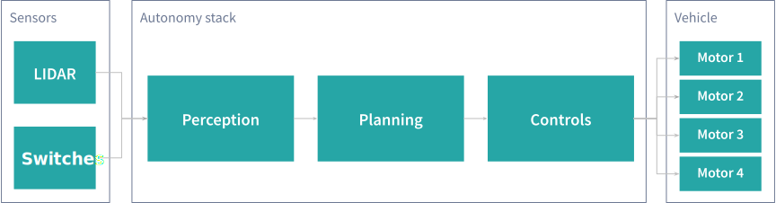

# Introduction #

Hello, welcome to Automated Infinite Recharge! This is a Python client for the [FRC 2020
Simulator](https://github.com/ptkinvent/frcsim2020), both written by [FRC Team SHARP
3260](https://www.sharprobotics.org/). We're attempting to write a 100% completely autonomous robot to play the 2020 FRC
game, called Infinite Recharge, by leveraging the power of the simulated LIDAR sensor in the sim. The sim mimics a
simple $100 2D LIDAR we found on RobotShop. Our goal was to prove how much value we could get from purchasing such a
LIDAR and using it in FRC next year as well as learn some algorithms and advanced robotics during the pandemic when we
can't work on the physical robot.

From the outset, we intentionally chose not to pursue a reinforcement-learned approach to our robot for several reasons.
Firstly, we wanted to design an approach which would scale well to the real world so that our software would work when
deployed on the real robot after the pandemic ends. If we designed a reinforcement-learned stack, it might quickly learn
how to play the game well in the sim, but really struggle once deployed to the physical robot because the sim is not
realistic. For example, we guessed the coefficients of friction for various parts of the field and don't simulate
physics like wheels slipping well. We are aware of approaches for circumventing these issues, but we also place a lot of
value on determinism for debugging and testing for actively ensuring our features don't regress as we make improvements.

That said, our stack consists of three high-level components: perception, planning, and controls. Data travels
sequentially through each of these steps, starting with raw LIDAR and other sensor data coming into the perception
stack. The final output from controls consists of motor signals for the tank drive and ball intake/outtake system.

