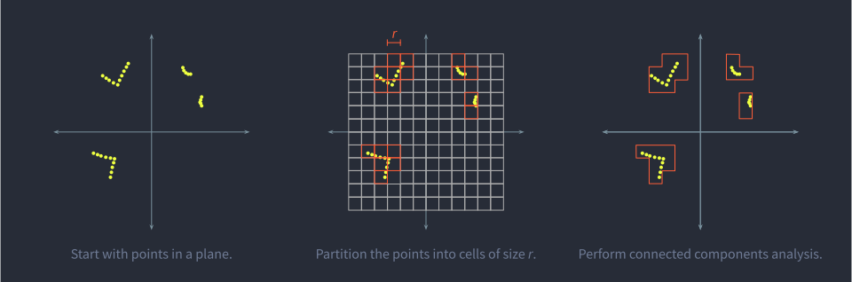
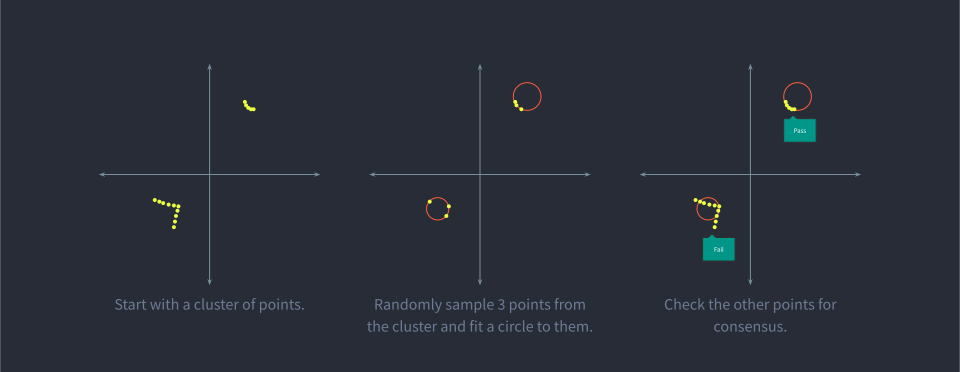

# Perception #

The purpose of our perception stack is to take raw sensor from the onboard LIDAR and convert them into a more usable
form for planning. Specifically, our perception stack aims to detect balls and obstacles on the field and output them in
a format convenient for planning. We specifically want our stack to distinguish between these two types of objects
because we want to drive toward balls but avoid driving into obstacles.

## LIDAR Preprocessing ##

The stack begins with some very simple preprocessing of the LIDAR data. The data comes from the sensor in polar
coordinates in the sensor frame.

Firstly, we convert these points from polar to Cartesian using the following formula, where \\( r \\) is the range
(distance) measurement of the LIDAR and \\( \theta \\) is the azimuth angle measured off the x-axis according to the
right-hand rule.

$$ x = r \cos \theta \\\ y = r \sin \theta $$

This gives us our points in sensor frame Cartesian. Next, we convert the points from sensor to vehicle frame. In the
sim, the sensor and vehicle frames happen to be perfectly aligned so no transformation is needed.

## Localization ##

Once we have our LIDAR sweep in vehicle frame, we can compare it to a LIDAR sweep taken from the center of the field to
calculate the vehicle's position on the field. We use an algorithm called Iterative Closest Point (ICP) to achieve this.
The algorithm iteratively calculates the mean-squared loss by comparing both sweeps point-by-point to find the rotation
and translation needed to overlay the two given sweeps on top of one another. This is the same rotation and translation
of the vehicle on the field.

The purpose of localization is to transform our points from vehicle frame to global frame. Note that our "global" frame
is actually just affixed to the field. The center of the global frame is the center the field, with the x- and y-axes
parallel to the shorter and longer widths of the field, respectively, as shown in the figure below. The output of
localization is three constants: \\( \theta \\), \\( t_x \\), and \\( t_y \\).

Once we have localized ourselves with respect to the field, we convert all our points from vehicle frame to global
frame. This is done using matrix multiplication for parallelization and efficiency using the following affine
transformation matrix:

$$ \left[\begin{matrix} x_\text{global} \\\ y_\text{global} \\\ 0 \end{matrix}\right] =
\left[\begin{matrix} \cos \theta & - \sin \theta & t_x \\\ - \sin \theta & \cos \theta & t_y \\\ 0 & 0 & 1 \end{matrix}\right]
\cdot \left[\begin{matrix} x_\text{vehicle} \\\ y_\text{vehicle} \\\ 0 \end{matrix}\right] $$

## Background Subtraction ##

Now that our sweep is in the global frame, we can finally begin the more complicated logic for finding balls and
obstacles in the field. We begin by subtracting the points which belong to the static obstacles of the field itself,
such as the various columns and trench walls. Because these objects are static, we can simply store each as a polygon,
slightly expand each one by 1%, then simply remove any points which fall inside these polygons using a fast
point-in-polygon check. For the exterior wall of the field, we shrink its polygon by 1% and remove any points that fall
outside it. The result is a list of points which belong to the "foreground," or dynamic obstacles such as balls and
robots.

## Clustering ##

Next, we cluster together points that are close to each other. By doing this, we hope to collect the points that belong
to a single ball or robot together so that they can be be recognized as a ball or robot.

We considered many different kinds of clustering algorithms, including DBSCAN and k-means clustering, but ultimately
chose to go with a simple grid-based algorithm because it was easy to implement and very fast. Our algorithm can also be
executed in parallel, although it isn't currently.

Our approach partitions the field into square cells, then performs connected component analysis to connect neighboring
occupied cells into connected components. Although this approach is quick and simple, it often fails to associate
clusters of points together on other robots, which results in the same robot being identified as two separate obstacles.
A more improved algorithm might perform better on these cases and help prevent the motion planner from planning from
right through the middle of a robot.

## Classification ##

Classification is used to identify which clusters represent balls and which represent robots, and fit approximate shapes
that represent them. For our oversimplified case, we assume everything that is not a ball is a robot. Balls are detected
by running RANSAC on each cluster of points to see if a circle with a radius of 3.5 inches can be fit to the points with
99% consensus after 10 random trials. All clusters that fail RANSAC are assumed to be other robots and have a simple
axis-aligned bounding box (AABB) fit to them for simplicity.

## Future Work ##
Our perception can sometimes be very jumpy. Even while driving straight towards a ball, our perception stack will
occasionally switch to thinking it's an obstacle instead. We can add smoothing to our code to mitigate this issue, but a
more robust solution might be overhauling our obstacle classification to be more accurate. Increasing RANSAC's
iterations tends to measurably impacts performance. One alternative might be a deep-learned CNN for better recognition.
