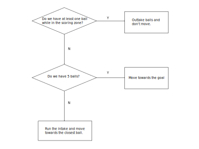

# Planning #

Planning's purpose is to identify where the robot should go, and the path it should take to get there.

## Behavior Planning ##
The purpose of behavior planning is to define the goals and behavior of the robot. These goals and specific actions
defined by behavior planning are essential to the robot's motion planning and carrying out these actions.

## Motion Planning ##
Motion planning's purpose is to take a defined goal, and find a trajectory (series of nodes to navigate through) that
reaches it from the robot's current position. The trajectory is designed to be as short as possible while avoiding all
obstacles.

## TODO ##
  - [ ] All the obstacles on the field are currently dilated by the radius of the robot, which is its diagonal length.
    This works fine in most cases and prevents collisions, but unfortunately does not allow the robot to pass through
    the trench anymore because it is too large to fit diagonally in the trench.
  - [ ] Behavior: If no more balls are visible on the field, then move towards the human player station.
  - [x] Smooth out the kinks in A*'s plan.
  - [ ] Find a way to plan out of an obstacle if the robot walks into an occupied call.
