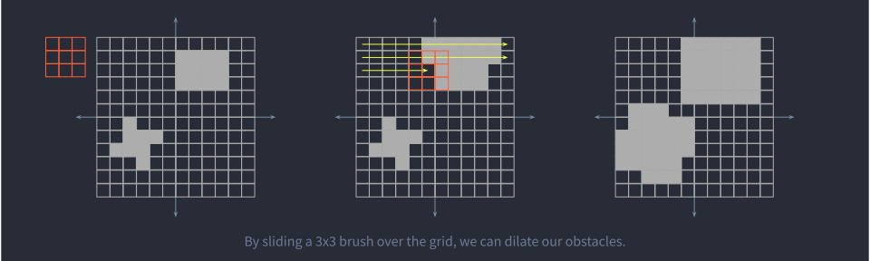

# Planning #

The purpose of our planning stack is to take the output of perception (detected balls and obstacles) and decide how to
actuate our robot at every moment. There are two main components to this: behavior planning and motion planning.

## Behavior Planning ##

The planning stack begins with behavior planning, which consists of the highest-level planning done by our robot. At
this level, our robot reasons about whether it should continue picking up balls, head towards the goal, or outtake balls
into the goal. The final result of behavior planning is a concrete physical location towards which the robot should
drive towards, whether to drive towards that goal forwards or backwards (drive forward to pick up balls or reverse
towards the goal) and whether or not the intake and/or outtake should be running. Our behavior planning logic is fairly
simplistic at the moment and can be summed up in this flowchart:

In the future, we hope to add more functionality including:
  - Special scoring behavior during the autonomous period which tries to pick up as many balls in the first few seconds
    while still having time to score them into the goal during autonomous.
  - Predictions from the perception stack on whether an opponent is likely to reach a ball before us.
  - Awareness of the game timer so that we can program special subroutines for the endgame (last few seconds before the
    end of the game), including heading directly toward the center of the field and climbing onto the Generator Switch
    for extra points.

## Motion Planning ##

Our motion planning stack is specifically concerned with determining how to get from the robot's current position to the
goal position selected by behavior planning while avoiding any obstacles -- static ones like the columns and trenches on
the field or dynamic ones such as other robots.

We chose to use A* for path planning because it is fast, simple to implement and guarantees optimality. Since A*
requires an occupancy grid for planning, we designed an occupancy grid with 8-connected cells and an algorithm for
inserting arbitrary polygonal obstacles into the grid. It works well since our problem is only two-dimensional, and we
haven't encountered any memory problems while running on a 4th gen Raspberry Pi with 10 cm cells. However, since our A*
assumes that the robot is a point mass, we simply add a buffer around all obstacles on the field close to the radius of
our robot. This has the unfortunate side effect of not allowing us to pass through the trench (since the robot can't fit
diagonally in the trenches), but we hope to improve this with future algorithms. Rather than writing our own dilation
algorithm, we leveraged OpenCV.

Although our motion planning is currently fast, we hope to improve it in the future by integrating it more closely with
controls so that we can successfully drive through the trenches. One way to achieve this is using model-predictive
control to forward-simulate the robot. Although this can be computationally heavy, especially if performed repeatedly
for many possible trajectories, this method is highly parallelizable.

## TODO ##
  - [ ] All the obstacles on the field are currently dilated by the radius of the robot, which is its diagonal length.
    This works fine in most cases and prevents collisions, but unfortunately does not allow the robot to pass through
    the trench anymore because it is too large to fit diagonally in the trench.
  - [ ] Behavior: If no more balls are visible on the field, then move towards the human player station.
  - [x] Smooth out the kinks in A*'s plan.
  - [ ] Find a way to plan out of an obstacle if the robot drives into an occupied call.
